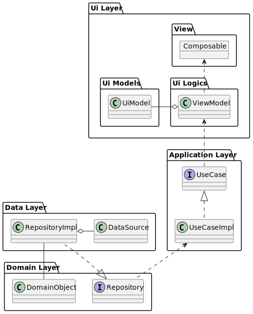

## TodoMobileAppにおけるアーキテクチャ
TodoMobileAppでは、**MVVM × Clean Architecture** というアーキテクチャを採用します。  
構成図は以下のとおりです。

[UMLコード](uml/architecture.puml)

## 各レイヤーの説明
### Ui Layer
UI LayerはUIに関する情報を処理・通知するレイヤーです。  
以下のコンポーネントがこのレイヤーに含まれます。

- Composableな関数
- Fragment
- Activity
- ViewModel
- UiModel

### Application Layer
Application LayerはUIに必要なユースケースを定義するレイヤーです。  
例えば、Todoリスト一覧ページには以下のユースケースが必要になります。

- タスク一覧を表示する
- タスク一覧を更新する
- タスクの絞り込みを行い、一覧を表示する
- etc...

### Domain Layer
Domain Layerはアプリに必要なドメイン（業務）を定義するレイヤーです。
例えば、本アプリでは以下のようなものがドメインとなります。

- タスク
- ユーザー
- アプリの設定

### Data Layer
Data Layerはドメインの永続化や外部APIとの通信を行うレイヤーです。  
ドメインの永続化はRepositoryImpl(Repositoryの実装クラス), 外部APIとの通信はApi/ApiClientで行います。  
また、SDKを利用する場合とWebAPIを利用する場合で実装が異なるため、柔軟な実装が必要となります。  

## 参考
- https://www.wantedly.com/companies/progrit/post_articles/474355
- https://gist.github.com/mpppk/609d592f25cab9312654b39f1b357c60
