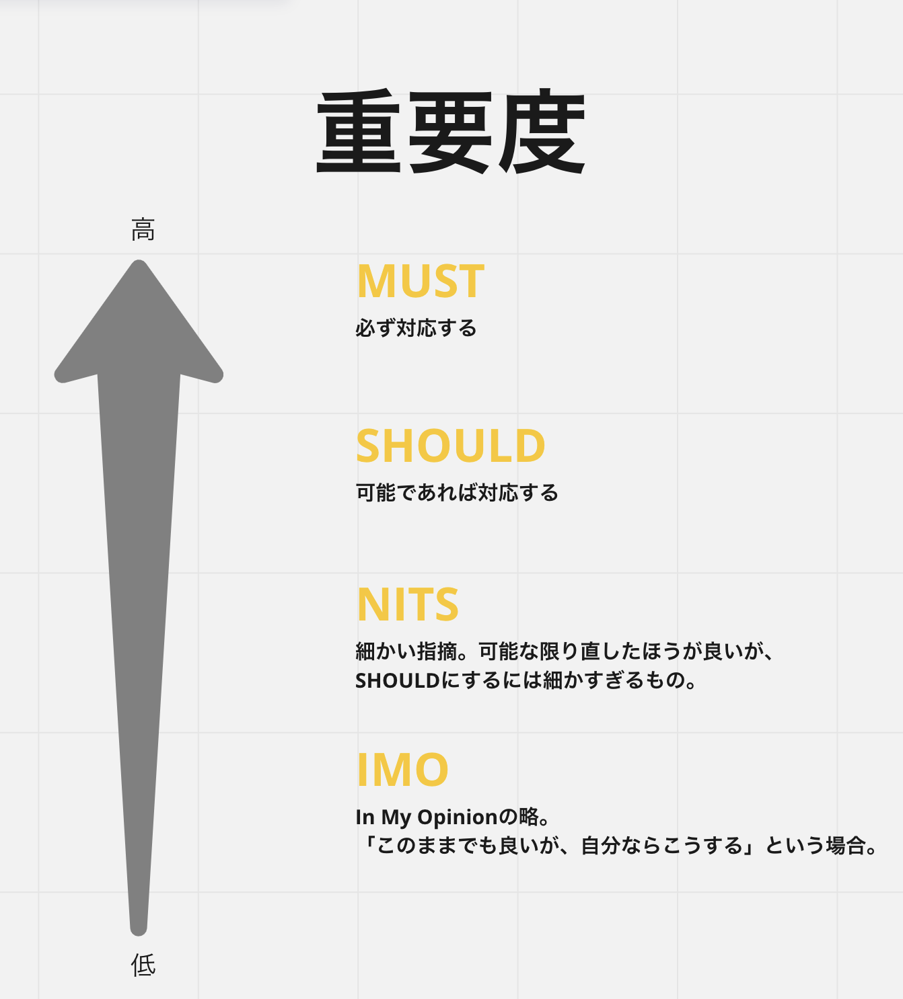
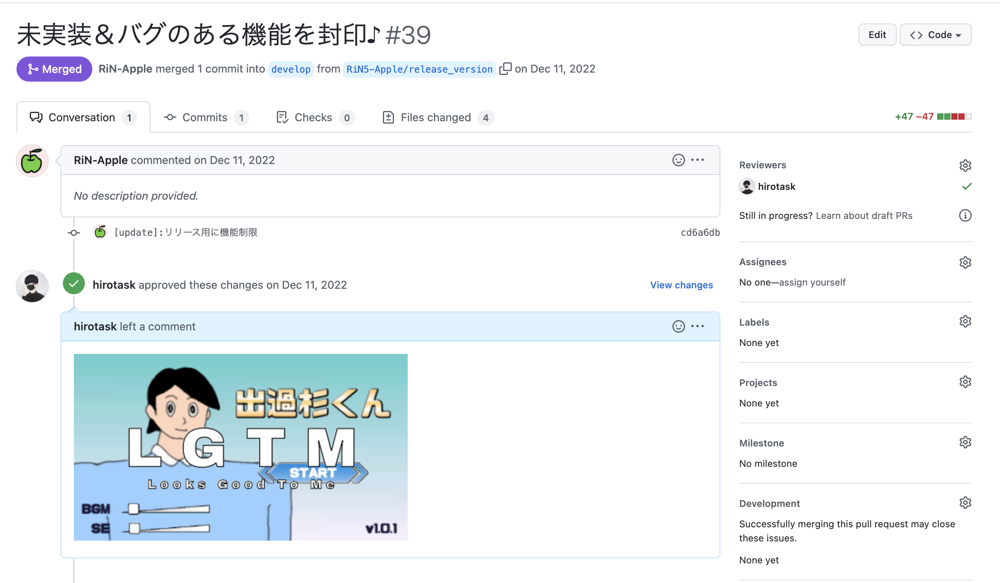

## レビューにおけるプラクティス
このドキュメントは、PR(Pull Request)におけるレビュワー(レビューする人), レビュイー(レビューされる人)に向けたドキュメントです。  

### 重要度
本ドキュメントでは、プラクティスの重要度を以下のように定めています。  
  
また、レビューにおいてもこれを意識することでコミュニケーショントラブルが起こりにくくなります。

## 謙虚・尊敬・信頼の気持ちを忘れない
#### MUST
- Humility（謙虚）
- Respect（尊敬）
- Trust（信頼）

の頭文字をとって**HRT**とも言われます。  
「〇〇してください」といった命令口調ではなく、「〇〇なので、△△したほうが良いと思います👀」のように提案する形を変えるなど、レビュワーとレビュイーも心がけましょう。  

## レビュワーはレビュイーのアプローチを尊重しよう
#### SHOULD
自分とアプローチが違うからといって、レビュイーを否定してはいけません。  
レビュイーのアプローチを可能な限り尊重しましょう。その上で指摘があった場合は、NITSやIMOであると明記して指摘しましょう。

## レビューはまとめて返そう
#### SHOULD
レビューをひとつずつ残すのではなく、まとめてレビューは残しましょう。

## 5日以内にレビューは返そう
#### SHOULD
可能であれば、レビューが出てから5日以内で返すようにしましょう。  
もし5日以内にレビューできないのであれば、その旨をレビュイーに伝えましょう。  

## 絵文字、またはMEMEを残そう
#### IMO
レビューをしたら、感謝の意味を込めて以下のように絵文字またはMEMEを残しましょう。  

それだけで嬉しい気持ちになったり、楽しくなったりします。  
